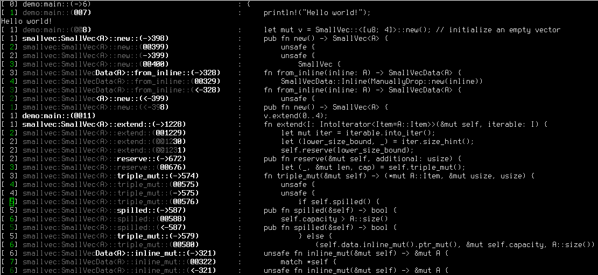

# Instru: Instrument Rust code using Rust

This crate (`instru`), along with changes to nightly Rust (November 10, 2018)
and Cargo, demonstrates the ability to perform whole-program tracing by
applying code injections to the AST (Abstract Syntax Tree) during the compilation
phase to all crates as a preprocessing stage, without modifying their sources.

Here's an example of a program self-tracing itself:

The instrumented program crate in the `demo` directory is similar to one of
`smallvec`'s [examples](demo/src/main.rs), and it makes no direct referencs
to `instru`.

To demo the use of `instru`, modified versions of Rust nightly and Cargo are
required. The `instru_plugin` implements a special compiler plugin, and `instru`
implements the code that is called by the code that the plugin adds to the AST.

## Rust changes

[da-x's Rust instru Branch](https://github.com/da-x/rust/tree/instru)

The content of this branch over Rust nightly contain the following changes:

* Implementation of the `function!` macro, which returns a static `&str` which
tells the name of the current module's function. There's currently an [open
RFC on the subject](https://github.com/rust-lang/rfcs/issues/1743).

* The addition of a whole-crate AST transformation plugin API. The
`WholeCrateTransformers` API allows a `ast::Crate -> ast::Crate` function to
operate on the Crate, before and/or after macro expansion, adding or removing
code all over.

## Cargo changes

[da-x's Cargo instru Branch](https://github.com/da-x/cargo/tree/instru)

For top level programs:

* The addition of a `active-plugins` config to a profile. This is a list of strings.

For plugin crates:

* The addition of a `plugin-recursive-until-crates` to `[lib]`. It's a list of crate names.

* The addition of a `plugin-dependencies` to `[lib]`. It's a list of dependencies.

### Remarks:

* For each crate on which the plugin is activated, `plugin-dependencies` gives the
list of dependencies that would be implicitly added to the compilation of the
crate. These would be called henceforth "plugin support code". This would be code
that is called by the code that is added to the crate's AST by the plugin. These
dependencies will be added as implicit dependencies of all dependent crates (expect
those coming from Rust, e.g.: `std`), on which the plugin activates.

* If a crate's name is in `plugin-recursive-until-crates`, the propagation
of the plugin's activation in the dependency tree stops. This limits the number of
build variations of the same crate inside a single execution, so that there would be
some crates that link a single time, both to the plugin's support code and the
main executable.

* Due to these changes, it is possible that the same crate of the same version
will be built and linked twice into the executable. One build will be _without_ the
activation of the plugin, and the other _with_ the activation of the plugin. The reason is
that the plugin support code may depend on the same crate as the program on which
it is activated, either indirectly or directly.

# Notes

Feel free to contact me regarding anything related to this work.
